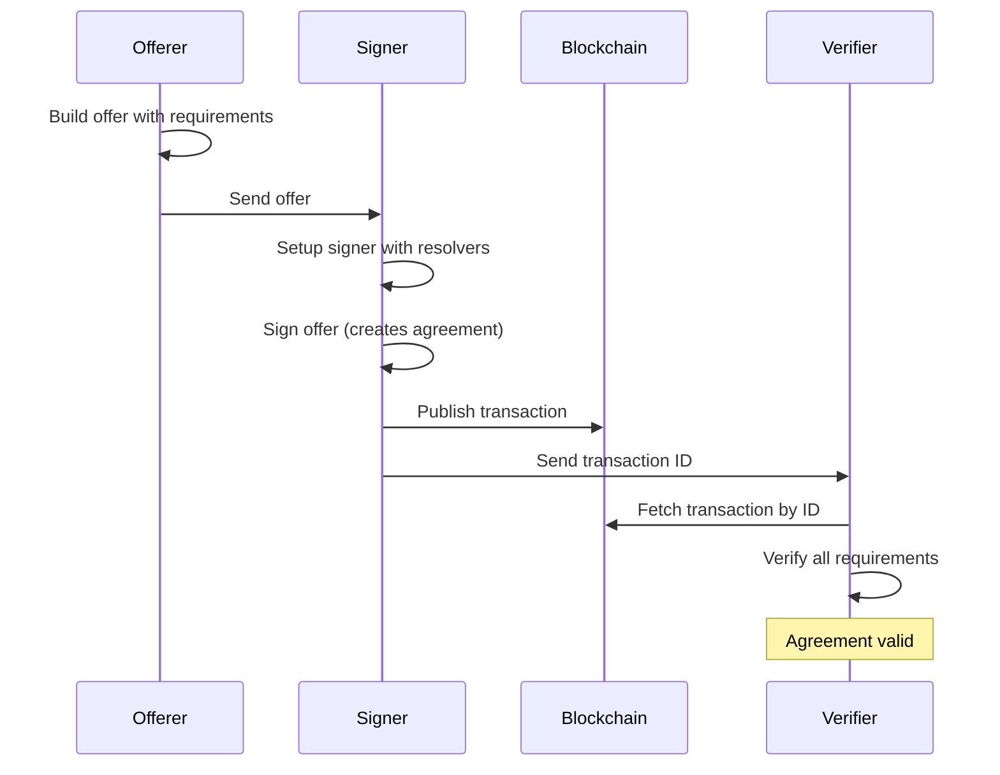
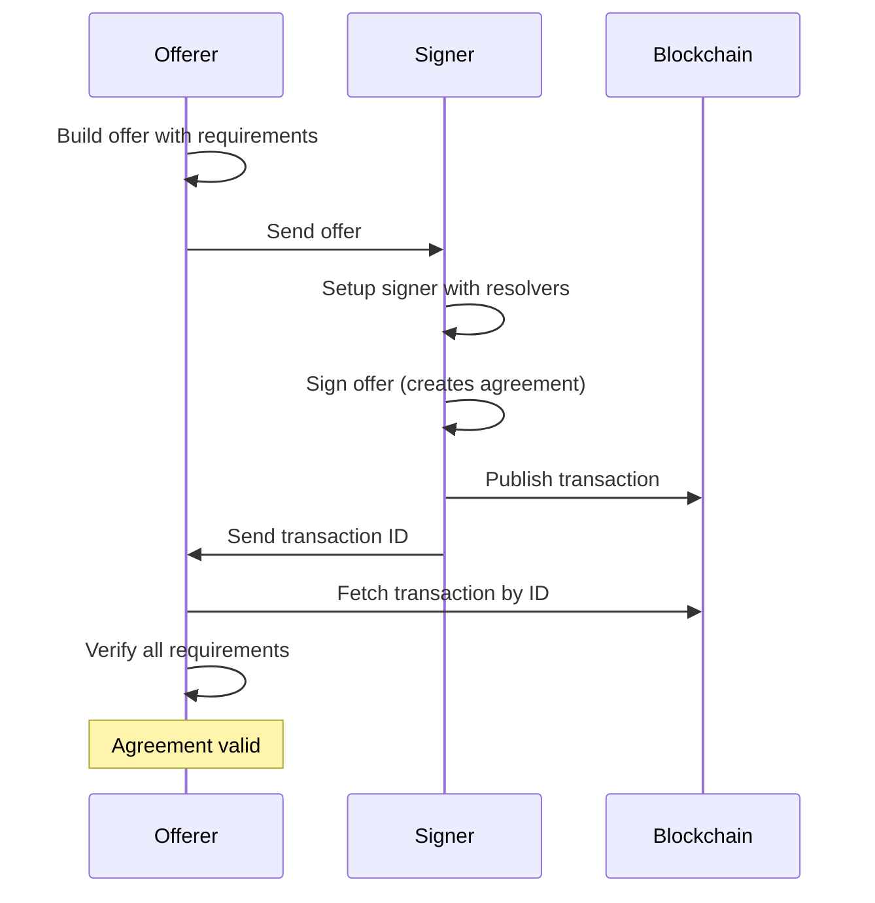

This example demonstrates building an offer, signing it to create an agreement, and verifying the agreement.

## Setup

```typescript
import {
  DaiaOfferBuilder,
  DefaultDaiaOfferSigner,
  DefaultDaiaAgreementVerifier,
  DefaultDaiaSignRequirementResolver,
  DefaultDaiaPaymentRequirementResolver,
  DaiaOfferSignResponseType,
  DaiaAgreementVerificationResult,
} from '@d4ia/core';
import {
  PrivateKey,
  BsvTransactionFactory,
  BsvTransactionParser,
  BsvNetwork,
} from '@d4ia/blockchain';

// Generate keys for both parties
const offererKey = PrivateKey.fromRandom();
const signeeKey = PrivateKey.fromRandom();
const network = BsvNetwork.TEST;
```

## Step 1: Build the Offer

The offerer creates an offer with requirements:

```typescript
const signeePublicKey = signeeKey.toPublicKey().toString();
const paymentAddress = offererKey.toPublicKey().toAddress('testnet').toString();

const offer = DaiaOfferBuilder.new()
  .setOfferTypeIdentifier('parking-access')
  .setNaturalLanguageContent('1-hour parking access for 1000 satoshis')
  .addSelfSignedRequirement(offererKey)
  .addSignRequirement(signeePublicKey)
  .addSelfAuthenticatedPaymentRequirement(paymentAddress, 1000)
  .build();
```

## Step 2: Sign the Offer

The signer creates a signer instance and signs the offer:

```typescript
// Create transaction factory
const factory = new BsvTransactionFactory(signeeKey, network);

// Create resolvers
const signResolver = new DefaultDaiaSignRequirementResolver(signeeKey);
const paymentResolver = new DefaultDaiaPaymentRequirementResolver(factory);

// Create signer
const signer = new DefaultDaiaOfferSigner({
  transactionFactory: factory,
  signResolver,
  paymentResolver,
});

// Sign the offer
const signResponse = await signer.signOffer({ offer });

if (signResponse.type !== DaiaOfferSignResponseType.SUCCESS) {
  throw new Error('Signing failed');
}

const { agreement, transaction } = signResponse;

// Publish to blockchain
await transaction.publish();

console.log('Agreement published:', transaction.id);
```

## Step 3: Verify the Agreement

Anyone can verify the agreement from the blockchain:

```typescript
// Create parser and verifier
const parser = new BsvTransactionParser(network);
const verifier = new DefaultDaiaAgreementVerifier(parser);

// Verify from transaction ID
const result = await verifier.getAgreementFromTransaction(transaction.id);

if (!result.found) {
  throw new Error('Agreement not found');
}

const { agreement: verifiedAgreement, verification } = result;

if (verification.result === DaiaAgreementVerificationResult.PASSED) {
  console.log('Agreement is valid!');
  console.log('Total payments:', verification.totalAgreementPayments);
} else {
  console.log('Verification failed:', verification.result);
  if (verification.failedRequirementIds) {
    console.log('Failed requirements:', verification.failedRequirementIds);
  }
}
```

## Alternative: Direct Verification

You can also verify an agreement directly without fetching from blockchain:

```typescript
const verifyResponse = await verifier.verifyAgreement({
  agreement,
  transactionData: transaction.data,
});

if (verifyResponse.result === DaiaAgreementVerificationResult.PASSED) {
  console.log('Agreement is valid');
}
```

## Complete Flow



### Simplified: When Offerer Verifies

In many cases, the offerer is also the verifier. This simplifies the flow:



## Key Points

1. **Offerer builds** the offer with all requirements
2. **Signer fulfills** requirements using resolvers
3. **Agreement published** to blockchain in a transaction
4. **Anyone can verify** the agreement using the transaction ID
5. **Verification checks** all requirements were properly satisfied
