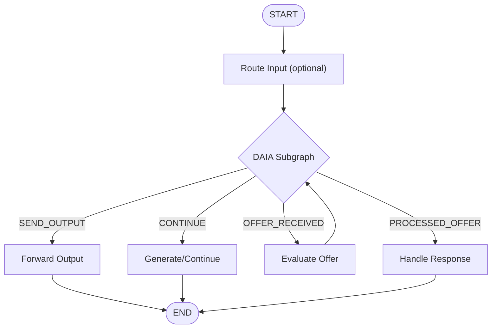

This guide shows the minimal steps to build a DAIA-enabled AI agent using LangGraph.


For detailed explanation of how DAIA integrates with LangGraph, state management internals, and execution flow, see the [LangGraph Integration Architecture]() reference.



This graph shows how your nodes connect to the DAIA subgraph:



## Understanding DAIA Input

DAIA accepts two types of input:

1. **Natural Language**: Regular text like "Hello" or "I need parking"
2. **DAIA Messages**: Protocol messages with the prefix `@@##__DAIA-MSG__##@@` followed by JSON

DAIA automatically detects and routes both types appropriately. When it receives a DAIA message, it parses the protocol structure and updates internal state accordingly. Natural language is passed to your conversation handlers.


DAIA messages are protocol-level messages like handshake exchanges, offer proposals, and agreement responses. They follow a specific JSON schema and are automatically serialized/deserialized by the DAIA subgraph. See the [Message Protocol Reference]() for complete details.


### Passing Input to DAIA

Your application needs to pass input from your graph state into the DAIA state. Here's the pattern:

```typescript
.addNode('routeInput', async (state) => {
  const writer = DaiaLanggraphStateWriter.fromState(state.daia);
  
  return {
    // Instead of state.input any field from state can be used.
    // Daia expects argument to setInput method to be string message of whatever was sent by remote agent or empty string when starting a conversation.
    daia: writer.setInput(state.input).build(),
  };
})
```

**Key points:**
1. Create a writer from the existing `state.daia`
2. Call `setInput()` with your text input
3. Build and return the updated DAIA state
4. Only update the `daia` field - DAIA never accesses other state keys


DAIA only accesses the `daia` field in your graph state. All other fields are ignored by the protocol. This ensures clean separation between application state and protocol state.


## What DAIA Provides

From `@d4ia/langchain`:
- `DaiaLanggraphStateSchema` - Protocol state schema
- `makeInitialDaiaLanggraphState()` - Initial state
- `DaiaLanggraphStateAccessor` - Read protocol state
- `DaiaLanggraphStateWriter` - Update protocol state
- `makeDaiaGraph()` - Protocol subgraph
- `DaiaLanggraphMachineNode` - Exit node names

From `@d4ia/core`:
- `DaiaOfferBuilder` - Build offers
- `DaiaAgreementReferenceResult` - Accept/reject enums

## What You Implement

1. **State Schema** - Your state + `daia: DaiaLanggraphStateSchema` field
2. **4 Handler Nodes** - Evaluate offers, generate offers, forward output, handle responses
3. **Graph Wiring** - Connect your nodes with DAIA subgraph

## Step 1: State Schema

```typescript
import { DaiaLanggraphStateSchema, makeInitialDaiaLanggraphState } from '@d4ia/langchain';
import z from 'zod';

export const AgentStateSchema = z.object({
  input: z.string(),
  output: z.string(),
  // Your fields here...
  daia: DaiaLanggraphStateSchema, // Required
});

export const initialState = {
  input: '',
  output: '',
  daia: makeInitialDaiaLanggraphState(),
};
```

## Step 2: DAIA Subgraph

```typescript
import { makeDaiaGraph, DaiaLanggraphMachineNode } from '@d4ia/langchain';

const daiaSubgraph = makeDaiaGraph<typeof AgentStateSchema>({
  publicKey: yourPublicKey.toString(),
  mapNode: (node) => 'D_' + node,
});

const SEND_OUTPUT = 'D_' + DaiaLanggraphMachineNode.SEND_DAIA_OUTPUT;
const CONTINUE = 'D_' + DaiaLanggraphMachineNode.CONTINUE_CONVERSING;
const OFFER_RECEIVED = 'D_' + DaiaLanggraphMachineNode.OFFER_RECEIVED;
const PROCESSED_OFFER = 'D_' + DaiaLanggraphMachineNode.REMOTE_PROCESSED_OFFER;
```

## Step 3: Handler Nodes

```typescript
import { StateGraph, START, END, Command } from '@langchain/langgraph';
import { DaiaLanggraphStateAccessor, DaiaLanggraphStateWriter } from '@d4ia/langchain';
import { DaiaOfferBuilder, DaiaAgreementReferenceResult } from '@d4ia/core';

const graph = new StateGraph(AgentStateSchema)
  // Route input to DAIA
  .addNode('routeInput', async (state) => ({
    daia: DaiaLanggraphStateWriter.fromState(state.daia)
      .setInput(state.input)
      .build(),
  }))
  
  // DAIA protocol subgraph
  .addNode('daiaSubgraph', async (state) => 
    await daiaSubgraph.invoke(state), {
      ends: [SEND_OUTPUT, CONTINUE, OFFER_RECEIVED, PROCESSED_OFFER],
    })
  
  // Forward protocol output
  .addNode(SEND_OUTPUT, async (state) => ({
    output: DaiaLanggraphStateAccessor.fromNamespacedState(state).getOutput(),
  }))
  
  // Generate offers or continue conversation
  .addNode(CONTINUE, async (state) => {
    const accessor = DaiaLanggraphStateAccessor.fromNamespacedState(state);
    
    // Your logic: decide to offer or chat
    if (shouldMakeOffer()) {
      const offer = DaiaOfferBuilder.new()
        .setNaturalLanguageContent('Your offer text')
        .setOfferTypeIdentifier('YOUR_TYPE')
        .addSelfSignedRequirement(yourPrivateKey)
        .addSignRequirement(accessor.remotePublicKey()!)
        .build();
      
      return new Command({
        goto: 'daiaSubgraph',
        update: {
          daia: DaiaLanggraphStateWriter.fromState(state.daia)
            .proposeOffer(offer)
            .build(),
        },
      });
    }
    
    return { output: 'Your chat response' };
  })
  
  // Evaluate received offers
  .addNode(OFFER_RECEIVED, async (state) => {
    const accessor = DaiaLanggraphStateAccessor.fromNamespacedState(state);
    const offer = accessor.getOffer()!;
    
    // Your logic: evaluate offer
    const shouldAccept = await evaluateOffer(offer);
    
    if (shouldAccept) {
      const signResponse = await signer.signOffer({ offer });
      await signResponse.transaction.publish();
      
      return {
        daia: DaiaLanggraphStateWriter.fromState(state.daia)
          .setOfferResponse({
            result: DaiaAgreementReferenceResult.ACCEPT,
            agreement: signResponse.agreement,
            agreementReference: signResponse.transaction.id,
          })
          .build(),
      };
    }
    
    return {
      daia: DaiaLanggraphStateWriter.fromState(state.daia)
        .setOfferResponse({
          result: DaiaAgreementReferenceResult.REJECT,
          rationale: 'Reason for rejection',
        })
        .build(),
    };
  })
  
  // Handle offer responses
  .addNode(PROCESSED_OFFER, async (state) => {
    const response = DaiaLanggraphStateAccessor
      .fromNamespacedState(state)
      .getOfferResponse()!;
    
    if (response.result === DaiaAgreementReferenceResult.ACCEPT) {
      // Your logic: verify and handle acceptance
      const verified = await verifier.getAgreementFromTransaction(
        response.agreementReference
      );
      return { output: verified.found ? 'Accepted' : 'Verification failed' };
    }
    
    return { output: `Rejected: ${response.rationale}` };
  })
```

## Step 4: Wire Edges

```typescript
  .addEdge(START, 'routeInput')
  .addEdge('routeInput', 'daiaSubgraph')
  .addEdge(SEND_OUTPUT, END)
  .addEdge(CONTINUE, END)
  .addEdge(OFFER_RECEIVED, 'daiaSubgraph')  // Loop back
  .addEdge(PROCESSED_OFFER, END);

const compiled = graph.compile();
```

**Key:** `OFFER_RECEIVED` must loop back to `daiaSubgraph` to serialize the response.

## Usage

```typescript
let state = { ...initialState, input: 'Hello' };
const result = await compiled.invoke(state);
console.log(result.output);

// Next turn
state = { ...result, input: 'I accept' };
const result2 = await compiled.invoke(state);
```


