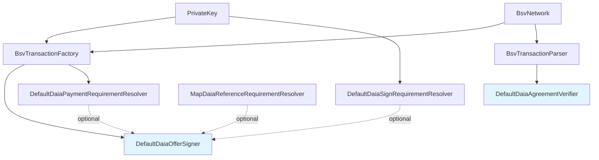

## Overview

Signers and verifiers are the core components for creating and validating DAIA agreements:

- **Signers** accept offers and fulfill their requirements (signatures, payments, references) to create agreements, which are then published to the blockchain
- **Verifiers** read agreements from the blockchain and validate that all requirements were properly satisfied

The BSV blockchain implementation provides:

- **`DefaultDaiaOfferSigner`** - Signs offers to create agreements and publishes them to BSV blockchain
- **`DefaultDaiaAgreementVerifier`** - Verifies agreements by reading and validating BSV transactions

## Type Dependencies



## Requirement Resolvers

Resolvers fulfill specific requirement types when signing offers. When a signer receives an offer with requirements, these resolvers determine how to satisfy each requirement type.

### DefaultDaiaSignRequirementResolver

**Purpose:** Creates cryptographic signature proofs for SIGN requirements. Verifies the signer's public key matches the required key, generates a nonce, and signs the offer content.

```typescript
import { DefaultDaiaSignRequirementResolver } from '@d4ia/core';
import { PrivateKey } from '@d4ia/blockchain';

const privateKey = PrivateKey.fromRandom();
const signResolver = new DefaultDaiaSignRequirementResolver(privateKey);
```

### DefaultDaiaPaymentRequirementResolver

**Purpose:** Handles PAYMENT requirements by either aggregating self-authenticated payments into the main transaction, or creating separate blockchain transactions for remote-authenticated payments.


The default payment resolver will pay any amount to any address specified in the offer's payment requirements. **Always validate payment amounts and recipient addresses in the offer before signing.**



```typescript
import { DefaultDaiaPaymentRequirementResolver } from '@d4ia/core';
import { BsvTransactionFactory, PrivateKey, BsvNetwork } from '@d4ia/blockchain';

const privateKey = PrivateKey.fromRandom();
const factory = new BsvTransactionFactory(privateKey, BsvNetwork.TEST);
const paymentResolver = new DefaultDaiaPaymentRequirementResolver(factory);
```

### MapDaiaReferenceRequirementResolver

**Purpose:** Resolves AGREEMENT_REFERENCE requirements by mapping reference types to agreement pointers. Used when offers require proof of access to previous agreements identified by type strings.

```typescript
import { MapDaiaReferenceRequirementResolver, DaiaRemoteAgreementPointerType } from '@d4ia/core';

const referenceResolver = MapDaiaReferenceRequirementResolver.builder()
  .addReference('parking-pass', {
    type: DaiaRemoteAgreementPointerType.TX_ID,
    txId: 'abc123...',
  })
  .build();
```

## Examples

See [Build-Sign-Verify Example]() for a complete workflow example.
