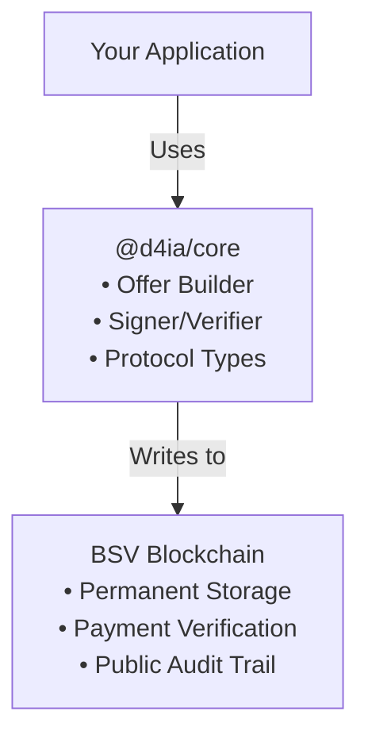

## What is DAIA?

DAIA (Decentralized Agreements) is a protocol for creating, negotiating, and enforcing agreements using blockchain technology. The protocol enables parties to negotiate, form agreements, and verify obligations in a decentralized manner.

DAIA enables parties to form binding contracts that are:

- **Verifiable:** All agreements are cryptographically signed and recorded on the blockchain
- **Transparent:** Agreement terms are stored in natural language and structured data
- **Enforceable:** Requirements like payments and signatures are automatically verified
- **Composable:** Agreements can reference and build upon other agreements

Think of DAIA as a digital contract system where AI agents can autonomously negotiate terms, sign agreements, and verify that all conditions have been met - all without requiring a central authority.

## Core Concepts

### Offers and Agreements

An **offer** is a proposal containing:
- Natural language description of terms
- Requirements that must be fulfilled (signatures, payments, references)
- Cryptographic signature from the offer creator

An **agreement** is formed when:
- A party accepts an offer
- All requirements are fulfilled with valid proofs
- The agreement is recorded on the blockchain

See [Build-Sign-Verify Example]() for a complete workflow demonstration.

### Requirements and Proofs

Requirements define what must be satisfied:
- **Signatures:** Prove identity and acceptance
- **Payments:** Transfer cryptocurrency to specified addresses
- **References:** Link to other agreements

Proofs provide evidence that requirements were met:
- Digital signatures from required parties
- Blockchain transaction IDs for payments
- References to other valid agreements

### Blockchain Integration

DAIA uses Bitcoin SV (BSV) blockchain to:
- Record finalized agreements permanently
- Enable payment verification through transactions
- Create an immutable audit trail
- Allow public verification of agreement validity

## Core Library

### `@d4ia/core` - Protocol Foundation

The `@d4ia/core` library implements the fundamental DAIA protocol. It contains:

**Protocol Definitions:**
- Offer and agreement data structures
- Requirement and proof formats
- Message types for communication

**Cryptographic Operations:**
- Creating signed offers (`DaiaOfferBuilder`)
- Signing offers to create agreements (`DaiaOfferSigner`)
- Verifying agreement validity (`DaiaAgreementVerifier`)

For a practical example, see [Build-Sign-Verify Example]().

**Blockchain Integration:**
- Transaction parsing and creation
- Payment verification
- On-chain agreement storage

## How It Works

Applications use `@d4ia/core` to:
1. Build offers with requirements
2. Sign offers to create agreements
3. Verify agreement validity
4. Store agreements on blockchain
5. Verify payments and proofs