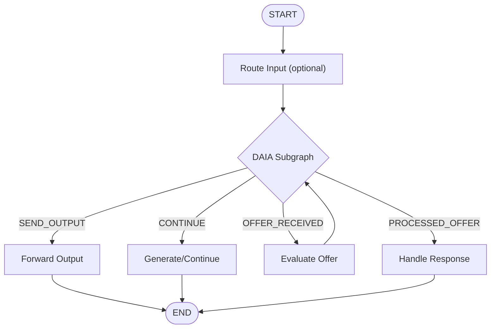

This document explains the architecture of DAIA's LangGraph integration, including state management, execution flow, and key design decisions.

## LangGraph Basics

[LangGraph](https://langchain-ai.github.io/langgraph/) is a framework for building stateful, multi-actor applications with LLMs. It allows you to define agent workflows as graphs where:

- **Nodes** represent functions that process state
- **Edges** define the flow between nodes
- **State** is passed through the graph and updated by nodes
- **Subgraph** a `StateGraph` which acts as a single node in parent `StateGraph`

```typescript
import { StateGraph } from '@langchain/langgraph';

// Define state structure
type AgentState = {
  input: string;
  output: string;
};

// Create graph
const graph = new StateGraph<AgentState>()
  .addNode('process', (state) => {
    return { output: `Processed: ${state.input}` };
  })
  .addEdge('__start__', 'process')
  .addEdge('process', '__end__')
  .compile();

// Use graph
const result = await graph.invoke({ input: 'Hello', output: '' });
console.log(result.output); // "Processed: Hello"
```

DAIA provides a pre-built subgraph (`makeDaiaGraph`) that handles protocol logic, which you integrate into your application's LangGraph.

## Core Principles

### One Message = One Graph Invocation

Each graph execution processes exactly one input and produces one output. This stateless-per-turn design means:

- **Input arrives** → Graph executes START to END → **Output returned**
- To continue conversation, invoke graph again with new input
- All context carried in state between invocations
- No background processes or event loops

**Why this design?**
- Predictable execution model
- Easy to debug and test
- Simple to scale horizontally
- Clear separation between turns

```typescript
// Turn 1
let state = { ...initialState, input: 'Hello' };
let result = await graph.invoke(state);
// result.output = protocol message or chat response

// Turn 2 - use previous state
state = { ...result, input: 'New message' };
result = await graph.invoke(state);
```

## State Architecture

### State Namespacing

DAIA protocol state lives in a `daia` field within your graph state:

```typescript
type YourAgentState = {
  input: string;
  output: string;
  // Your fields...
  daia: DaiaLanggraphState;  // Protocol state
}
```

This namespacing:
- Prevents name collisions between protocol and app state
- Makes it clear what's protocol vs application data
- Allows multiple protocol integrations if needed


The `DaiaLanggraphState` type contains protocol internals. **Never read or write this state directly.** Always use `DaiaLanggraphStateAccessor` for reading and `DaiaLanggraphStateWriter` for writing. Direct access breaks encapsulation and may cause protocol errors.


### Input Processing

DAIA accepts two types of input:

1. **Natural Language**: Regular text like "Hello" or "I need parking"
2. **DAIA Messages**: Protocol messages with the prefix `@@##__DAIA-MSG__##@@` followed by JSON

The subgraph automatically detects and routes both types. When it receives a DAIA message, it parses the protocol structure and updates internal state. Natural language triggers routing to your conversation handlers.

**Passing Input to DAIA:**

Your application passes input from your graph state into DAIA state:

```typescript
.addNode('routeInput', async (state) => {
  const writer = DaiaLanggraphStateWriter.fromState(state.daia);
  
  return {
    daia: writer.setInput(state.input).build(),
  };
})
```


DAIA only accesses the `daia` field in your graph state. All other fields are ignored by the protocol. This ensures clean separation between application state and protocol state.


## State Accessor Pattern

### DaiaLanggraphStateAccessor

Read-only interface to protocol state:

```typescript
const accessor = DaiaLanggraphStateAccessor.fromNamespacedState(state);

// Read protocol data
const input = accessor.getInput();           // Current input
const output = accessor.getOutput();         // Protocol output message
const offer = accessor.getOffer();           // Received offer
const response = accessor.getOfferResponse(); // Response to your offer
const remoteKey = accessor.remotePublicKey(); // Remote agent key

// Check state
const ready = accessor.isDaiaReady();   // Can send/receive offers?
const canCall = accessor.canCallMethod(); // Can call protocol methods?
```

### DaiaLanggraphStateWriter

Immutable state updates using [Immer](https://immerjs.github.io/):

```typescript
const writer = DaiaLanggraphStateWriter.fromState(state.daia);

// Set input for next protocol turn
writer.setInput('Hello');

// Clear input
writer.clear();

// Propose an offer
writer.proposeOffer(offerContent);

// Respond to offer
writer.setOfferResponse({
  result: DaiaAgreementReferenceResult.ACCEPT,
  agreement: ...,
  agreementReference: txId,
});

// Build immutable new state
const newDaiaState = writer.build();
```

## Subgraph Architecture

### How makeDaiaGraph Works

The DAIA subgraph wraps the protocol state machine:

```typescript
const daiaSubgraph = makeDaiaGraph({
  publicKey: yourPublicKey.toString(),
  mapNode: (node) => 'D_' + node,
});
```

**Internally:**

```typescript
// Simplified internals
const graph = new StateGraph(schema)
  .addNode("input", async (state) => {
    // Run state machine
    const output = await machine.run(state.daia);
    
    // Route to appropriate exit node
    return new Command({
      goto: mapNode(output.targetNode), // E.g., 'D_SEND_OUTPUT'
      graph: Command.PARENT,            // Exit to parent graph
      update: { daia: output.newState },
    });
  });
```

### Exit Nodes

The subgraph routes to 4 possible exit nodes. After handling each exit node, your graph must route to the next appropriate node:

- **Your Node:** Jump to any node you define in your graph
- **DAIA:** Loop back to the DAIA subgraph (required for `OFFER_RECEIVED`)
- **Exit:** End the graph execution and return output

| Exit Node | When | Your Handler Should | Next Node |
|-----------|------|---------------------|-----------|
| `SEND_DAIA_OUTPUT` | Protocol message ready | Forward `output` to network | Your Node or Exit |
| `CONTINUE_CONVERSING` | Continue conversation | Generate response or offer | DAIA(when calling method using writer) or Your Node |
| `OFFER_RECEIVED` | Remote agent sent offer | Evaluate and accept/reject | DAIA (required) |
| `REMOTE_PROCESSED_OFFER` | Remote responded to your offer | Verify and handle | Your Node or Exit |



DAIA controls the communication flow by routing to `SEND_DAIA_OUTPUT` whenever it needs to send a message. This includes protocol messages (handshakes, offers, responses) and allows DAIA to send custom messages when needed. Your handler at this exit node receives the message and forwards it to the network.

Here is that table represented in a form of graph, which shows how flow works in agent graph, which uses DAIA subgraph:




You map `DaiaLanggraphMachineNode` to actual node names using the `mapNode` function. For each `DaiaLanggraphMachineNode` exit node, you specify the name of that node in your graph. For simplicity, you can add a prefix to make name generation easier:

```typescript
// Using a prefix pattern for simplicity
const daiaSubgraph = makeDaiaGraph({
  publicKey: yourPublicKey.toString(),
  mapNode: (node) => 'D_' + node,  // Prefix all DAIA nodes with 'D_'
});

// Now create handlers for the prefixed nodes
const SEND = 'D_' + DaiaLanggraphMachineNode.SEND_DAIA_OUTPUT;
const CONTINUE = 'D_' + DaiaLanggraphMachineNode.CONTINUE_CONVERSING;
const OFFER_RECEIVED = 'D_' + DaiaLanggraphMachineNode.OFFER_RECEIVED;
const REMOTE_PROCESSED = 'D_' + DaiaLanggraphMachineNode.REMOTE_PROCESSED_OFFER;
```

## Method Calls

### Proposing Offers

To send an offer, use the `proposeOffer` method:

```typescript
// In your CONTINUE node
const offer = DaiaOfferBuilder.new()
  .setNaturalLanguageContent('Parking: 5000 sats/hour')
  .setOfferTypeIdentifier('PARKING')
  .addSelfSignedRequirement(privateKey)
  .addSignRequirement(remotePublicKey)
  .build();

// Set method call
const daia = DaiaLanggraphStateWriter.fromState(state.daia)
  .proposeOffer(offer)
  .build();

// Route back to DAIA subgraph to process
// This is REQUIRED behavior when calling a method
return new Command({
  goto: 'daiaSubgraph',
  update: { daia },
});
```

**What happens:**
1. `proposeOffer` sets `input.methodCall`
2. DAIA subgraph sees method call
3. Processes offer and generates protocol message
4. Routes to `SEND_DAIA_OUTPUT` with message ready

### Method Call Types

```typescript
enum DaiaLanggraphMethodId {
  SEND_OFFER = 'SEND_OFFER',
  // Future: CANCEL_OFFER, UPDATE_OFFER, etc.
}
```

Currently only `SEND_OFFER` is supported. Method calls are how you instruct DAIA to perform protocol actions.

### Protocol Handshake

Before offers can be exchanged, agents must:
1. Exchange public keys
2. Establish protocol version
3. Confirm readiness

This happens automatically when:
- First message is sent
- Remote agent sends hello message

You can check readiness:

```typescript
if (accessor.isDaiaReady()) {
  // Can send/receive offers
}
```

## Design Patterns

### Partial State Updates

Nodes return partial state updates:

```typescript
// Only update what changed
return {
  daia: newDaiaState,  // Update protocol state
  output: 'response',  // Update output
  // Other fields preserved automatically
};
```

LangGraph merges updates into existing state. No need to spread entire state.

### Command for Routing

Use `Command` for dynamic routing:

```typescript
return new Command({
  goto: 'daiaSubgraph',        // Target node
  update: {                    // State updates
    daia: updatedDaiaState,
  },
});
```

Without `Command`, edges are static. `Command` enables:
- Conditional routing based on logic
- Looping back to subgraph
- Skipping nodes

### Immutable Updates with Immer

Both writer and your nodes should use Immer:

```typescript
import { produce } from 'immer';
import { DaiaLanggraphStateWriter } from '@d4ia/langchain';

return produce(state, (draft) => {
  draft.output = 'new value';
  
  // Create writer from current state, update, and build
  draft.daia = DaiaLanggraphStateWriter
    .fromState(state.daia)
    .setInput('text')
    .build();
});
```

**Important:** The DAIA state must be assigned to the `daia` key to maintain the namespaced structure in your parent graph.

## Common Pitfalls

### Forgetting the Loop Back

❌ **Wrong:** Direct edge from `OFFER_RECEIVED` to `END`

```typescript
.addEdge(OFFER_RECEIVED, END)  // Response never serialized!
```

✅ **Correct:** Loop back through subgraph

```typescript
.addEdge(OFFER_RECEIVED, 'daiaSubgraph')  // Serialize response
```

### Mutating State Directly

❌ **Wrong:** Direct mutation

```typescript
state.daia.input.text = 'new text';  // Mutation!
```

✅ **Correct:** Use writer

```typescript
const newDaia = DaiaLanggraphStateWriter
  .fromState(state.daia)
  .setInput('new text')
  .build();
```

## Summary

**Key Takeaways:**

1. **One invocation = one turn:** Stateless per execution
2. **Namespaced state:** `daia` field contains protocol state
3. **Accessor for reads:** Type-safe querying of protocol data
4. **Writer for updates:** Immutable state construction
5. **Subgraph routes:** To 4 exit nodes based on protocol state
6. **Loop back required:** For `OFFER_RECEIVED` to serialize responses
7. **Method calls:** Instruct DAIA to perform protocol actions
8. **Partial updates:** Only return changed state fields


