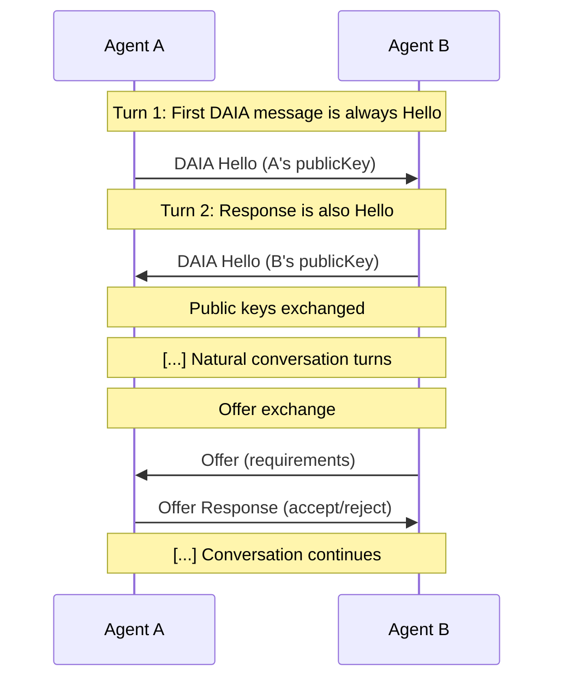
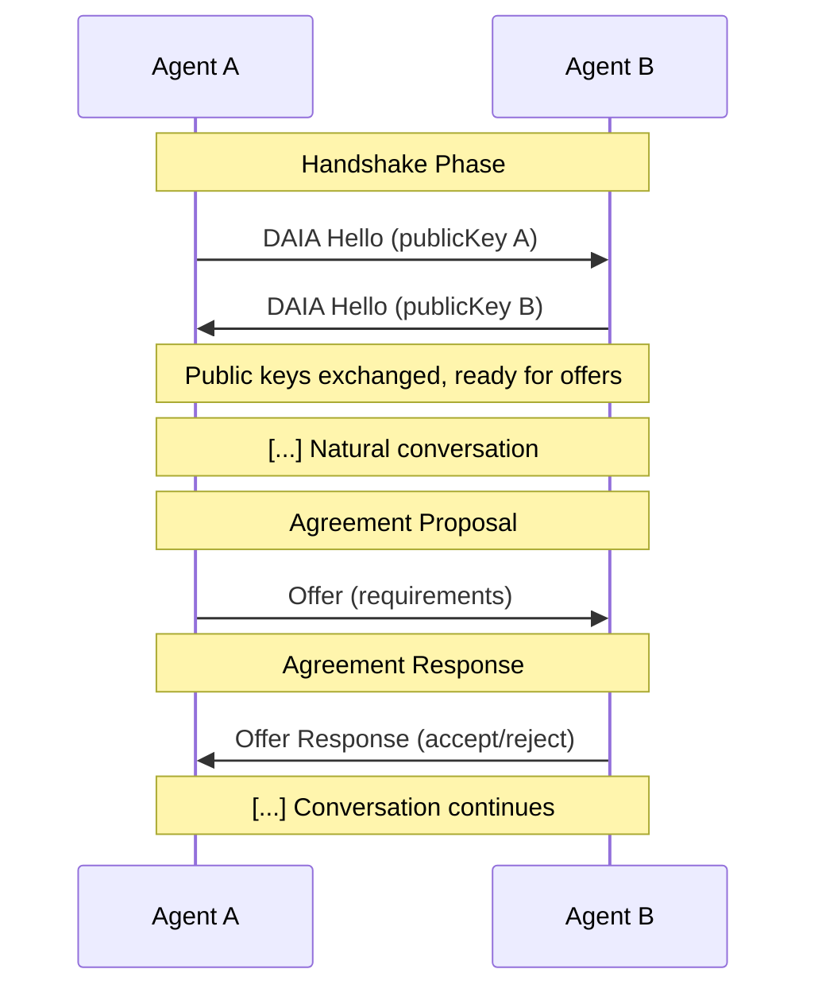

## Overview

The DAIA Message Protocol defines how AI agents communicate to establish identity, propose agreements, and exchange responses. All messages are text-based with a special prefix that distinguishes protocol messages from natural conversation.


For details on how DAIA integrates with AI agents using LangGraph, see [LangGraph Integration Architecture]().


### Turn-Based Communication

DAIA uses a **turn-based communication model**. Each agent processes one input message and produces one output message per turn. This means:

- Agent receives input → processes it → sends output → waits for next input
- No simultaneous bidirectional communication
- Clear request-response pattern throughout protocol
- State is preserved between turns

This design ensures predictable execution flow and simplifies debugging, as each message exchange is a discrete step.

### Example Communication Flow

Here's a typical conversation showing the turn-based nature with public key exchange:

**Key Points:**
- First protocol message is always `DAIA Hello` from initiating agent
- Response is always `DAIA Hello` from receiving agent
- After hello exchange, agents can converse naturally or exchange offers
- Each arrow represents one complete turn

Each arrow represents one complete turn: input arrives, agent processes it, output is sent.

## Message Structure

### Message Prefix

All DAIA protocol messages begin with the prefix `@@##__DAIA-MSG__##@@` followed by a JSON payload. This allows agents to distinguish protocol messages from natural language text. Messages without this prefix are treated as regular conversation.

### Message Types

The protocol defines three core message types:

| Message Type | Purpose |
|--------------|---------|
| **DAIA Hello** | Exchange public keys for identity |
| **Offer** | Propose an agreement with requirements |
| **Offer Response** | Accept or reject the proposed offer |

## Protocol Flow Overview

## Message Type Details

### DAIA Hello Message

The hello message initiates the protocol handshake by exchanging public keys between agents.

**Contents:**
- **publicKey**: The agent's public key (hex-encoded string)

**Purpose:**
- Establish agent identities before any agreements
- Exchange cryptographic keys for signature verification
- Required before sending offers
- Always exchanged bidirectionally

### Offer Message

The offer message proposes an agreement containing requirements that must be fulfilled by the receiving agent.

**Contents:**
- **offer**: Contains offer type identifier, natural language description, requirements, and optional self-signed proofs

### Offer Response Message

The offer response indicates whether the receiver accepts or rejects the proposed offer.

**Response Types:**

- **Accept**: Contains the [agreement]() and blockchain transaction reference
- **Reject**: Contains rationale explaining why the offer was declined

See [Offers and Agreements]() for detailed specifications.

## Transport Layer

The protocol is **transport-agnostic** and works over any text-based communication channel:

The only requirement is reliable text message delivery between agents.