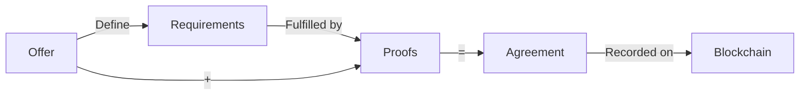

This document explains the structure and logic of offers and agreements in the DAIA protocol.

## Conceptual Model

### Offer → Agreement Flow

**Offer:** Proposal with requirements that must be satisfied  
**Requirements:** Conditions that must be met (signatures, payments, references)  
**Proofs:** Evidence that requirements were fulfilled  
**Agreement:** Offer + Proofs, published to blockchain


DAIA offers and agreements are protocol-level constructs that exist independently of blockchain transactions. Blockchain transactions serve as vessels to contain and publish complete signed DAIA agreements. The agreement data is embedded in the transaction (typically in an OP_RETURN output), while the transaction itself may also contain payment outputs that fulfill payment requirements within the agreement.


## Core concept: Offer?

An offer is a proposal containing requirements that must be satisfied to form a valid agreement. It defines what conditions the accepting party must fulfill (signatures, payments, or references to other agreements).

An offer in DAIA consists of three essential components:

### Requirements

Requirements define the conditions that must be satisfied for an agreement to be valid. Every offer must have at least one requirement (typically a self-signed signature requirement).

Each requirement is assigned a unique UUID and must be fulfilled with a corresponding proof when the offer is signed.

See [Requirements and Proofs]() for detailed specifications of all requirement types.

### Type Identifier

The `offerTypeIdentifier` is an application-specific string that categorizes the offer. This identifier helps recipients.

- Route offers to appropriate handlers
- Filter offers by category
- Apply business logic based on offer type
- Validate that offer structure matches expectations

DAIA accepts any value in this field and it's there for clients to use.

### Natural Language Content

The `naturalLanguageOfferContent` provides a human-readable description of the offer terms. This text:

- Explains what the offer entails in plain language
- Is included in cryptographic signatures
- Is typically recorded permanently on the blockchain
- Can be displayed to users for evaluation

The natural language content should clearly describe all terms, conditions, pricing, and expectations so that both parties understand what they are agreeing to.

## Core concept: Agreement?

An agreement is an offer with all requirements fulfilled via proofs. It represents a completed contract where:

- The **offer** defines what conditions must be met (requirements)
- The **proofs** demonstrate that those conditions were satisfied
- The **agreement** combines the original offer with the proofs that fulfill its requirements


An agreement can be verified using only its contents and access to external APIs (such as blockchain explorers for verifying payment transactions). The agreement itself **does not need to be stored on the blockchain to be considered valid**. However, certain requirement types (like self-authenticated payments) can only be fulfilled when the agreement is published to the blockchain as part of a transaction.


### How Offers Become Agreements

The only intended way to create agreements is by signing offers using `DaiaOfferSigner`. The signing process:

1. Takes an offer with its requirements
2. Uses resolvers to fulfill each requirement (signatures, payments, references)
3. Generates proofs for all fulfilled requirements
4. Combines the offer with proofs to create the agreement
5. Constructs a blockchain transaction containing the agreement (publication is optional)
6. Returns the transaction ready for publication

See [Signer/Verifier Setup]() for configuration details and [Build-Sign-Verify Example]() for a complete workflow.

### A Valid Agreement

An agreement is valid when every requirement has exactly one corresponding proof, all proofs are valid (signatures verify, payments match, references exist etc.), and the agreement structure is well-formed.